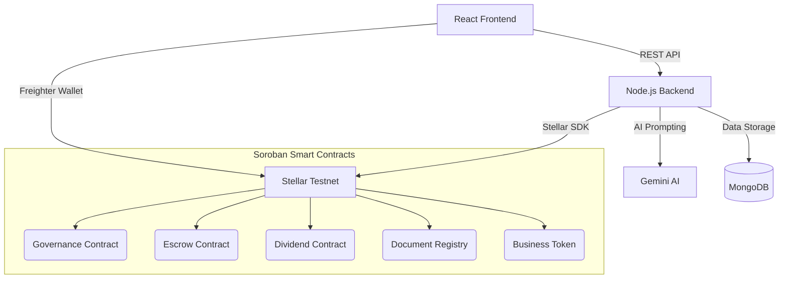

# InvestX - Fully Decentralized Investment Platform

Community-powered fractional investment platform for local businesses, built on Stellar + Soroban with AI-assisted business scoring and **fully decentralized on-chain governance**. No centralized admin approvals—the community decides everything!

## Table of Contents

- [Overview](#overview)
- [System Architecture](#system-architecture)
- [Technical Stack](#technical-stack)
- [Advanced Features](#advanced-features)
- [Deployed Contracts](#deployed-contracts)
- [User & Business Flows](#complete-user-flows)
- [Local Setup](#local-setup)
- [Environment Variables](#environment-variables)
- [License](#license)

## Overview

Small businesses often face financing gaps, and local communities typically cannot participate in early-stage growth opportunities. InvestX addresses both sides by enabling compliant micro-investments in vetted businesses through tokenized ownership and transparent on-chain settlement.

All platform decisions—from approving new business token launches to verifying monthly revenue dividends—are handled entirely by **on-chain DAO Governance**.

## System Architecture

InvestX uses a hybrid Web2/Web3 architecture. Heavy documents, KYC, and AI scoring run off-chain, while all financial logic, voting, and token ownership is strictly on-chain via Soroban.



## Technical Stack

| Layer | Technology | Purpose |
|---|---|---|
| **Frontend** | React, TailwindCSS, Axios | UI and client-side application |
| **Backend** | Node.js, Express 5 | REST API, AI coordination, tx simulation |
| **Database** | MongoDB Atlas | Off-chain profiles, metadata, caching |
| **Blockchain** | Stellar (Testnet) | Settlement layer |
| **Smart Contracts**| Rust (Soroban) | Decentralized logic and tokenization |
| **Wallets** | Freighter API (v6+) | Transaction signing |
| **AI Engine** | Google Gemini | Automated risk assessment & credit scoring |
| **Storage** | Pinata IPFS & Cloudinary| Decentralized document & image hosting |

## Advanced Features

- **Fully Decentralized Governance (DAO):** Zero admin intervention. All business approvals and revenue verification actions are executed via community voting on the Governance Smart Contract.
- **Fractional Tokenization:** Businesses are minted as SEP-41 compliant tokens. Investors can make micro-investments tracking fractional ownership.
- **On-Chain Escrow:** Investor funds are locked in a trustless Soroban escrow. If a business fails its funding goal, funds are mathematically guaranteed to be refunded.
- **Automated Dividend Routing:** Businesses submit XLM profits to the Dividend contract, which auto-routes payouts directly to token holders proportional to their shares based on real-time on-chain balances.
- **AI Risk Scoring:** Gemini evaluates uploaded business financial documents and generates transparent risk scores prior to community voting.
- **Cryptographic Document Registry:** Business KYC and financial documents are hashed and anchored to a Document Registry contract for immutable provenance.

## Deployed Contracts

*All contracts deployed on the Stellar Testnet.*

| Contract Function | Testnet Contract ID |
|-------------------|----------------------|
| **Business Token (Factory)** | `CCGD5P3SCFVBQHQJFG5YEHSDTGZQ27UFUTRGMM5FWT3FFMQ37QA2WIWM` |
| **Escrow Manager** | `CDQJFA7FWAFENCOBGYI5YTEIIIV2JWYWGPKMFTSKZCS3GVSVPSVDULXU` |
| **Dividend Distributor** | `CDH35PFTCU2WXPQ3LW4NFDJADNCEKK7RNH2UUNH5JRKFZ7O7U3UCFY6C` |
| **Document Registry** | `CAZZHGGQCK4XYSWQOY7NPSU247XMWA4PNJWUA6NU47TPQFK4E6EGVYZZ` |
| **DAO Governance** | `CCIMHOZAMXQXJRJJXAMBX2GXSGP6BCU7YRLYTJ5IJ446XEJYEW56UBAH` |

## Complete User Flows

### 1. Business Owner Flow
1. **Onboarding:** Owner registers, provides details, and uploads financial documents via Pinata IPFS.
2. **AI Screening:** Backend parses the financials via Gemini AI, generating a risk score and report.
3. **Governance Proposal:** A `BusinessApproval` proposal is automatically created on-chain.
4. **DAO Vote:** The community reviews the AI score and votes. If passed, the business is approved.
5. **Token Minting & Funding:** A customized business token is launched. Investors fund via the Escrow contract.
6. **Dividend Distribution:** Owner reports monthly revenue, deposits XLM to the Dividend Contract, which triggers a `RevenueVerification` DAO vote. Upon passing, dividends auto-disburse to token-holding investors based on live blockchain reads.

### 2. Investor Flow
1. **Registration:** Sign up natively and connect the Freighter Wallet.
2. **Browse:** Discover DAO-approved local businesses actively fundraising.
3. **Invest:** Fund businesses directly via Freighter. XLM is secured in the Soroban Escrow contract.
4. **Earn:** Receive fractional tokens if the campaign succeeds. Receive automated XLM dividend payments directly to the wallet based on live on-chain token balance.
5. **On-Chain Portfolio:** Track real-time token balances and dividend profits directly from Stellar Horizon data.

### 3. DAO Voter Flow
1. **Review Proposals:** View active business applications and revenue verifications.
2. **Analyze Data:** Read AI-generated risk reports and cryptographically verified document hashes.
3. **Vote On-Chain:** Sign transactions via Freighter to cast `Upvote` / `Downvote` on Soroban.
4. **Execution:** Once the deadline passes, automated backend workers trigger the finalization contract, structurally executing the community's decision (e.g., releasing funds or triggering dividends).

## Local Setup

### Prerequisites
- Node.js 18+
- MongoDB Atlas or local MongoDB instance
- Freighter wallet funded on Stellar testnet

### 1) Clone
```bash
git clone https://github.com/anindhabiswas25/InvestX.git
cd InvestX
```

### 2) Backend
```bash
cd backend
npm install
# copy over .env variables
npm run dev
```

### 3) Frontend
```bash
cd frontend
npm install
npm start
```

## Environment Variables

Include standard `.env` items in `backend`:
- `STELLAR_NETWORK` = testnet
- `STELLAR_HORIZON_URL` = https://horizon-testnet.stellar.org
- `GEMINI_API_KEY` 
- `PINATA_JWT`
- `MONGODB_URI`
(Include the Smart Contract IDs listed in the Deployed Contracts section above)

## License
MIT
