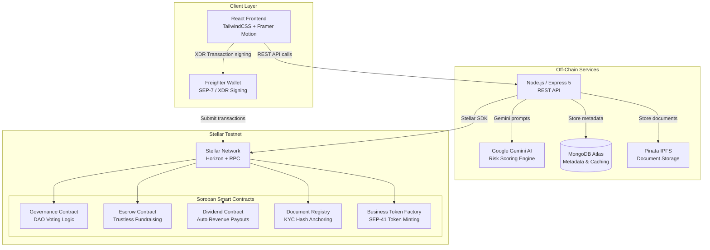

# InvestX — System Architecture & Design

## Overview

InvestX uses a **hybrid Web2/Web3 architecture**. Off-chain services handle heavy computation (AI scoring, document storage, user metadata), while all financial logic, token ownership, and governance is strictly enforced by Soroban smart contracts on Stellar.

---

## Architecture Diagram



---

## Layer Breakdown

### 1. Frontend — React SPA
| Concern | Implementation |
|---------|---------------|
| UI Framework | React 18 + TailwindCSS 3.4 |
| Animations | Framer Motion |
| Wallet | `@stellar/freighter-api` v6+ |
| State | React Context (AuthContext, WalletContext) |
| Routing | React Router v6 |
| HTTP | Axios |

### 2. Backend — Node.js API
| Concern | Implementation |
|---------|---------------|
| Runtime | Node.js 18, Express 5 |
| Auth | JWT + bcrypt |
| Database | Mongoose + MongoDB Atlas |
| File Upload | Multer + Cloudinary |
| Blockchain | `@stellar/stellar-sdk` |
| AI | Google Generative AI (`gemini-1.5-flash`) |

### 3. Smart Contracts — Soroban (Rust)
| Contract | Address (Testnet) | Role |
|----------|---|---|
| Business Token | `CCGD5P3SCFVBQHQJFG5YEHSDTGZQ27UFUTRGMM5FWT3FFMQ37QA2WIWM` | SEP-41 token factory per business |
| Escrow Manager | `CDQJFA7FWAFENCOBGYI5YTEIIIV2JWYWGPKMFTSKZCS3GVSVPSVDULXU` | Lock & refund investor XLM |
| Dividend Distributor | `CDH35PFTCU2WXPQ3LW4NFDJADNCEKK7RNH2UUNH5JRKFZ7O7U3UCFY6C` | Auto-route revenue to token holders |
| Document Registry | `CAZZHGGQCK4XYSWQOY7NPSU247XMWA4PNJWUA6NU47TPQFK4E6EGVYZZ` | Anchor KYC document hashes on-chain |
| DAO Governance | `CCIMHOZAMXQXJRJJXAMBX2GXSGP6BCU7YRLYTJ5IJ446XEJYEW56UBAH` | Community voting, zero admin override |

---

## Key Design Decisions

### Decentralized Governance
No single admin wallet can approve or reject a business. Every approval requires a supermajority DAO vote through the Governance Contract. This eliminates single points of failure and corruption.

### Trustless Escrow
Investor funds are held in the Escrow Contract, not by any backend wallet. The release condition (`funding_goal_reached`) is checked on-chain. If the campaign fails, refunds are cryptographically guaranteed.

### Off-Chain AI, On-Chain Anchoring
Gemini AI processes documents and produces a risk score off-chain (fast, cheap). The resulting hash is anchored in the Document Registry Contract, making the report tamper-evident.

### Hybrid Storage
Financial metadata, user profiles, and notification state live in MongoDB (fast reads). All ownership, balances, and votes live on Stellar (trustless). Documents live on IPFS (censorship-resistant).

---

## Data Flow: Investment Lifecycle

```
Investor → Frontend → Backend (validate) → Freighter (sign XDR)
    → Stellar Network → Escrow Contract (lock XLM)
    → Business Token Contract (mint tokens to investor)
    → Dividend Contract (register holder)
    → Future: Revenue deposited → Dividend auto-disbursed
```

---

## Scalability Considerations

- Stellar handles ~1,000 TPS at <$0.00001/tx — sufficient for MVP and early growth
- MongoDB Atlas auto-scales horizontally
- Vercel edge caching for frontend static assets
- Render auto-deploy for backend with zero-downtime deploys
